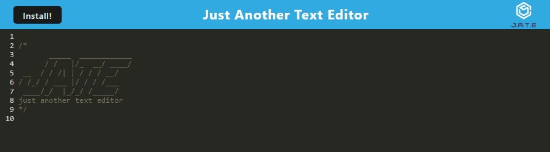

# Text Editor

## Table of Contents

- [Text Editor](#text-editor)
  - [Table of Contents](#table-of-contents)
  - [Description](#description)
  - [Deployment](#deployment)
  - [Installation](#installation)
  - [Usage](#usage)
  - [License](#license)

## Description

A simple text editor, named J.A.T.E (Just Another Text Editor) that meets the standards of a PWA. 

## Deployment

[See the app deployed on Heroku here.](https://immense-tor-29981.herokuapp.com/)

## Installation

To host your own version of this app, download the repository, and then in the terminal, on the repository, run `npm install`. Once that finishes running, you can run `npm start`, and the application will be hosted locally on port 3000.

## Usage

To use the app, just type in the editor! You can press enter to go to a new line and when you click off of the screen, the text will automatically save. 

You can also install the web application to your device with the install button.

## License

This project is licensed under a [MIT license](https://opensource.org/licenses/MIT).